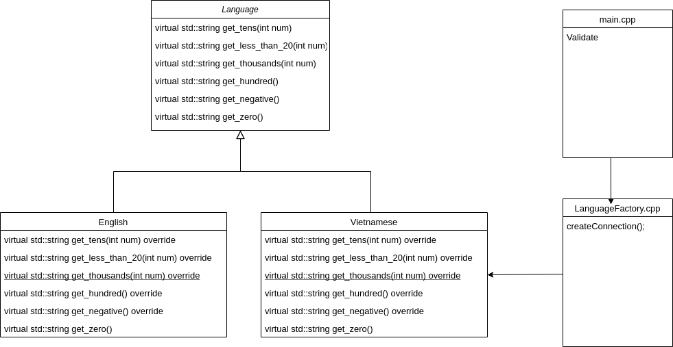

# Convert number to text-representation #

- [x] Support English and Vietnamese.
- [x] Can support up to 10^65 - 1.
- [x] Easily add new language(flexible design).

## How to run ##

* Go to "build" directory and run cmake..
* Run make generating "convert" elf file.
* Run elf file.

## UML ##
Format: 
